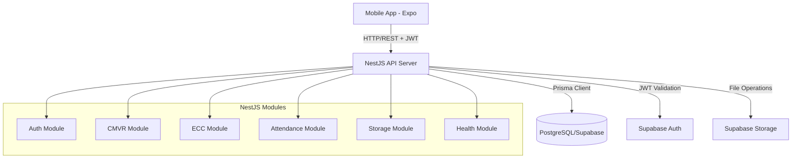
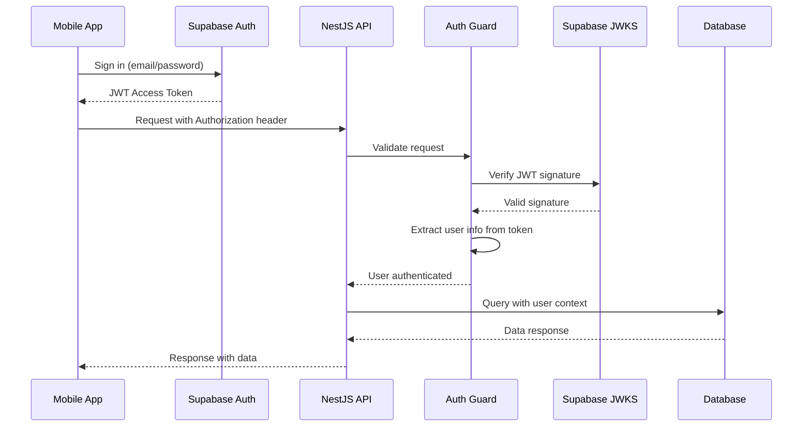
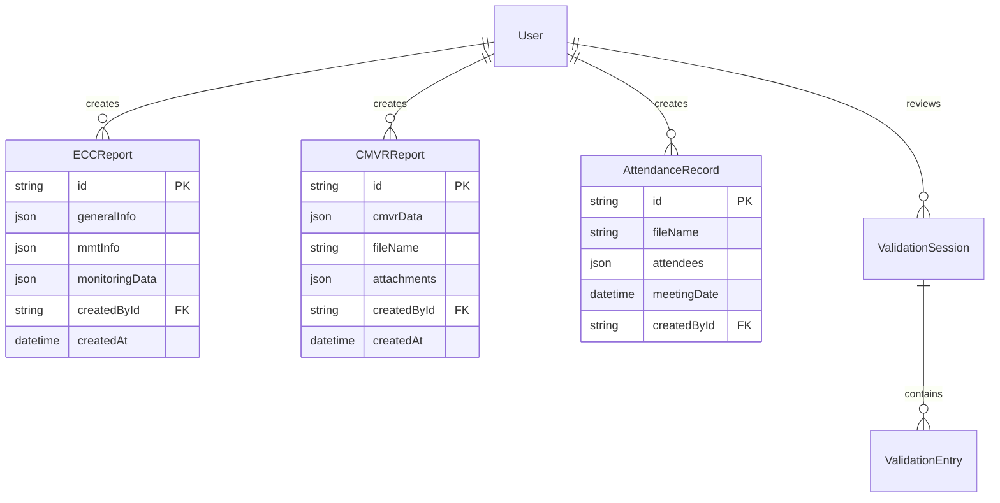

# MineComply API - Architecture Documentation

> Last Updated: December 2025

## Table of Contents

- [Overview](#overview)
- [Tech Stack](#tech-stack)
- [System Architecture](#system-architecture)
- [Module Structure](#module-structure)
- [Authentication Flow](#authentication-flow)
- [Database Architecture](#database-architecture)
- [Document Generation Pipeline](#document-generation-pipeline)
- [API Design Patterns](#api-design-patterns)
- [Deployment Architecture](#deployment-architecture)

---

## Overview

The MineComply API is a NestJS-based REST API that powers the MineComply platform - a compliance monitoring and validation system for mining operations in the Philippines. The API handles:

- **User authentication** via Supabase
- **Compliance report management** (CMVR, ECC)
- **Attendance record tracking** for monitoring meetings
- **Document generation** (PDF and DOCX)
- **File storage** via Supabase Storage
- **Validation workflows** for multi-party monitoring teams

## Tech Stack

| Component | Technology | Purpose |
|-----------|-----------|---------|
| **Framework** | NestJS 11.x | Node.js backend framework with TypeScript |
| **Database** | PostgreSQL (Supabase) | Primary data store |
| **ORM** | Prisma 5.x | Type-safe database access |
| **Authentication** | Supabase Auth + Passport JWT | JWT-based authentication |
| **File Storage** | Supabase Storage | Cloud file storage |
| **Document Generation** | PDFKit, docx | PDF and DOCX generation |
| **Validation** | class-validator, class-transformer | DTO validation |
| **API Documentation** | Swagger/OpenAPI | Auto-generated API docs |
| **Deployment** | Render.com | Cloud hosting |

## System Architecture



### Key Architectural Principles

1. **Modular Design**: Each business domain (CMVR, ECC, Attendance) is encapsulated in its own module
2. **Layered Architecture**: Controller → Service → Generator/Repository pattern
3. **Dependency Injection**: NestJS DI container manages all dependencies
4. **Type Safety**: Full TypeScript throughout with Prisma-generated types
5. **Security First**: JWT authentication on all routes (except public health endpoints)
6. **Document Generation Separation**: PDF/DOCX generation isolated in dedicated services

---

## Module Structure

### Core Application Modules

#### 1. App Module (`src/app.module.ts`)

The root module that orchestrates the entire application:

```typescript
@Module({
  imports: [
    ConfigModule.forRoot({
      isGlobal: true,
      load: [applicationConfig, supabaseConfig],
      validationSchema: configValidationSchema,
    }),
    SupabaseAuthModule,
    PrismaModule,
    HealthModule,
    StorageModule,
    AttendanceModule,
    CmvrModule,
    EccModule,
  ],
  providers: [
    AppService,
    { provide: APP_GUARD, useClass: SupabaseAuthGuard },
  ],
})
export class AppModule {}
```

**Responsibilities:**
- Global configuration management
- Module imports and wiring
- Global authentication guard

#### 2. Auth Module (`src/auth/`)

Handles Supabase-based authentication and authorization.

**Structure:**
```
auth/
├── auth.module.ts
├── supabase-auth.service.ts
├── strategies/
│   └── supabase-jwt.strategy.ts
├── guards/
│   └── supabase-auth.guard.ts
├── decorators/
│   ├── current-user.decorator.ts
│   └── public.decorator.ts
└── interfaces/
    └── supabase-user.interface.ts
```

**Key Components:**
- `SupabaseJwtStrategy`: Validates JWT tokens from Supabase
- `SupabaseAuthGuard`: Global guard applied to all routes (except `@Public()`)
- `@CurrentUser()`: Decorator to inject authenticated user into controllers
- `@Public()`: Decorator to bypass authentication for specific routes

**Authentication Flow:**
1. Mobile app authenticates with Supabase
2. Supabase returns JWT access token
3. App sends requests with `Authorization: Bearer <token>` header
4. API validates token using JWKS from Supabase
5. User info extracted and available via `@CurrentUser()` decorator

#### 3. CMVR Module (`src/cmvr/`)

Manages Compliance Monitoring and Validation Reports.

**Structure:**
```
cmvr/
├── cmvr.module.ts
├── cmvr.controller.ts
├── cmvr.service.ts
├── cmvr-pdf-generator.service.ts
├── cmvr-docx-generator.service.ts
├── cmvr-pdf.helpers.ts
├── cmvr-sections/          # Helpers for report sections
│   ├── basic-info.helper.ts
│   ├── compliance-monitoring.helper.ts
│   ├── executive-summary-compliance.helper.ts
│   ├── general-info.helper.ts
│   ├── general-use.helper.ts
│   └── process-documentation.helper.ts
└── dto/
    └── create-cmvr.dto.ts
```

**Responsibilities:**
- CRUD operations for CMVR reports
- Generate PDF/DOCX documents from report data
- Duplicate reports
- Link attendance records to reports

**Document Generation:**
- `CMVRPdfGeneratorService`: Generates PDF using PDFKit
- `CMVRDocxGeneratorService`: Generates DOCX using docx library
- Section helpers modularize complex report generation logic

#### 4. ECC Module (`src/ecc/`)

Manages Environmental Compliance Certificate reports.

**Structure:**
```
ecc/
├── ecc.module.ts
├── ecc.controller.ts
├── ecc.service.ts
├── ecc-pdf-generator.service.ts
├── ecc-word-generator.service.ts
├── ecc-pdf.helpers.ts
└── dto/
    ├── create-ecc-report.dto.ts
    ├── create-ecc-condition.dto.ts
    └── update-ecc-condition.dto.ts
```

**Responsibilities:**
- Manage ECC reports and conditions
- Track permit holders and compliance status
- Generate ECC compliance documents
- Condition CRUD operations

#### 5. Attendance Module (`src/attendance/`)

Manages attendance records for monitoring meetings.

**Structure:**
```
attendance/
├── attendance.module.ts
├── attendance.controller.ts
├── attendance.service.ts
├── pdf-generator.service.ts
├── docx-generator.service.ts
└── dto/
    ├── create-attendance-record.dto.ts
    └── update-attendance-record.dto.ts
```

**Responsibilities:**
- Record meeting attendance
- Generate attendance sheets (PDF/DOCX)
- Link attendance to CMVR reports
- Track participants and meeting details

#### 6. Storage Module (`src/storage/`)

Manages file uploads and downloads via Supabase Storage.

**Structure:**
```
storage/
├── storage.module.ts
├── storage.controller.ts
├── supabase-storage.service.ts
└── dto/
    ├── create-upload-url.dto.ts
    └── create-download-url.dto.ts
```

**Responsibilities:**
- Generate signed upload URLs
- Generate signed download URLs
- Delete files from storage
- Handle file metadata

#### 7. Health Module (`src/health/`)

Provides health check endpoints for monitoring and deployment.

**Structure:**
```
health/
├── health.module.ts
├── health.controller.ts
└── health.service.ts
```

**Endpoints:**
- `GET /health` - General health status
- `GET /health/live` - Liveness probe (uptime)
- `GET /health/ready` - Readiness probe (dependency checks)

#### 8. Prisma Module (`src/prisma/`)

Provides database access via Prisma Client.

**Structure:**
```
prisma/
├── prisma.module.ts
└── prisma.service.ts
```

**Responsibilities:**
- Singleton Prisma Client instance
- Connection lifecycle management
- Global injection point for database access

---

## Authentication Flow



### JWT Strategy Configuration

The API uses `passport-jwt` with JWKS validation:

```typescript
@Injectable()
export class SupabaseJwtStrategy extends PassportStrategy(Strategy, 'jwt') {
  constructor(configService: ConfigService) {
    super({
      jwtFromRequest: ExtractJwt.fromAuthHeaderAsBearerToken(),
      secretOrKeyProvider: jwksRsa.passportJwtSecret({
        cache: true,
        rateLimit: true,
        jwksUri: configService.get('supabase.jwksUrl'),
      }),
      issuer: configService.get('supabase.url'),
      audience: 'authenticated',
      algorithms: ['RS256'],
    });
  }

  async validate(payload: any): Promise<SupabaseUser> {
    return {
      id: payload.sub,
      email: payload.email,
      role: payload.role,
      // ... other claims
    };
  }
}
```

### Global Authentication Guard

All routes are protected by default:

```typescript
{
  provide: APP_GUARD,
  useClass: SupabaseAuthGuard,
}
```

To bypass authentication for public endpoints:

```typescript
@Public()
@Get('health')
healthCheck() {
  return this.healthService.getStatus();
}
```

---

## Database Architecture

### Schema Overview

The database uses PostgreSQL with Prisma ORM. Key tables:

| Table | Purpose |
|-------|---------|
| `User` | Application users synced from Supabase Auth |
| `ECCReport` | Environmental Compliance Certificate reports |
| `CMVRReport` | Compliance Monitoring & Validation Reports |
| `AttendanceRecord` | Meeting attendance records |
| `ValidationSession` | MMT validation sessions |
| `ValidationEntry` | Individual validation entries |
| `ECCCondition` | ECC conditions with RLS enabled |
| `profiles` | Supabase profiles with extended user metadata |

### Row-Level Security (RLS)

RLS is enabled on certain tables to prevent cross-company data leakage:

- **Enabled on**: `ECCCondition`, `profiles`
- **Policies**: Limit authenticated clients to records linked to their account
- **Service role**: API uses service role key to bypass RLS for privileged operations

**Example RLS Policy (SQL):**
```sql
-- Enable RLS on ECCCondition
ALTER TABLE "ECCCondition" ENABLE ROW LEVEL SECURITY;

-- Policy: Users can only access their own conditions
CREATE POLICY "Users can view own conditions"
ON "ECCCondition" FOR SELECT
USING (auth.uid() = user_id);
```

### Database Relationships



---

## Document Generation Pipeline

### PDF Generation (PDFKit)

**Flow:**
1. Controller receives report ID
2. Service fetches report from database
3. PDF generator service creates document stream
4. Sections are rendered sequentially (headers, tables, text)
5. Buffer returned to client as `application/pdf`

**Example from CMVR:**
```typescript
async generateGeneralInfoPdf(cmvrData: CMVRGeneralInfo): Promise<Buffer> {
  const doc = new PDFDocument({ size: 'LETTER', margin: 50 });
  const buffers: Buffer[] = [];
  
  doc.on('data', (chunk) => buffers.push(chunk));
  
  // Render sections
  this.renderHeader(doc, cmvrData);
  this.renderGeneralInfo(doc, cmvrData);
  this.renderTables(doc, cmvrData);
  
  doc.end();
  
  return Buffer.concat(buffers);
}
```

### DOCX Generation (docx library)

**Flow:**
1. Controller receives report ID
2. Service fetches report + optional attendance data
3. DOCX generator builds document structure
4. Tables, paragraphs, and images added
5. Buffer returned as `application/vnd.openxmlformats-officedocument.wordprocessingml.document`

**Example from Attendance:**
```typescript
async generateDocx(attendanceData: AttendanceRecord): Promise<Buffer> {
  const doc = new Document({
    sections: [
      {
        properties: {},
        children: [
          new Paragraph({ text: attendanceData.title, heading: HeadingLevel.HEADING_1 }),
          this.createAttendeesTable(attendanceData.attendees),
        ],
      },
    ],
  });
  
  return await Packer.toBuffer(doc);
}
```

---

## API Design Patterns

### Controller → Service → Generator Pattern

```
┌─────────────┐      ┌─────────────┐      ┌──────────────────┐
│ Controller  │─────▶│  Service    │─────▶│ PDF/DOCX         │
│ (Routes)    │      │ (Business)  │      │ Generator        │
└─────────────┘      └─────────────┘      └──────────────────┘
      │                     │
      │                     ▼
      │              ┌─────────────┐
      │              │ Prisma      │
      │              │ Service     │
      │              └─────────────┘
      │                     │
      ▼                     ▼
┌─────────────┐      ┌─────────────┐
│ DTO         │      │ Database    │
│ Validation  │      │             │
└─────────────┘      └─────────────┘
```

### DTOs and Validation

All input is validated using class-validator:

```typescript
export class CreateCMVRDto {
  @IsNotEmpty()
  @IsObject()
  cmvrData: Record<string, unknown>;
  
  @IsOptional()
  @IsArray()
  attachments?: Array<{ path: string; caption?: string }>;
}
```

### Response Patterns

- **Success**: Return data directly or wrapped in meaningful objects
- **Errors**: Throw NestJS exceptions (`NotFoundException`, `BadRequestException`)
- **Streaming**: Use `StreamableFile` for PDF/DOCX responses

---

## Deployment Architecture

### Render.com Configuration

**Deployment Type:** Web Service

**Environment Variables:**
```
NODE_ENV=production
PORT=3000
DATABASE_URL=postgresql://...
SUPABASE_URL=https://...
SUPABASE_ANON_KEY=...
SUPABASE_SERVICE_ROLE_KEY=...
SUPABASE_JWKS_URL=https://.../rest/v1/
SUPABASE_STORAGE_BUCKET=...
```

### Keep-Alive Mechanism

The API includes a cron job to prevent cold starts:

```typescript
// In main.ts
cron.schedule('*/10 * * * *', async () => {
  const res = await fetch('https://minecomplyapi.onrender.com/api/health');
  console.log(`🔁 Keep-alive ping: ${res.status}`);
});
```

### Health Monitoring

Health endpoints are used by Render for:
- **Liveness probe**: `/health/live` (is the app running?)
- **Readiness probe**: `/health/ready` (are dependencies available?)

---

## Configuration Management

### Environment Variables

Configuration is validated at startup using Joi:

```typescript
export const configValidationSchema = Joi.object({
  NODE_ENV: Joi.string().valid('development', 'production', 'test'),
  PORT: Joi.number().default(3000),
  DATABASE_URL: Joi.string().required(),
  SUPABASE_URL: Joi.string().uri().required(),
  SUPABASE_ANON_KEY: Joi.string().required(),
  // ... more validations
});
```

### Config Factory Pattern

```typescript
export default registerAs('app', () => ({
  environment: process.env.NODE_ENV || 'development',
  port: parseInt(process.env.PORT || '3000', 10),
  globalPrefix: process.env.GLOBAL_PREFIX || 'api',
  corsOrigins: process.env.CORS_ORIGINS?.split(',') || [],
}));
```

---

## Best Practices

1. **Module Boundaries**: Keep modules independent; use DI for cross-module communication
2. **Error Handling**: Use NestJS exception filters for consistent error responses
3. **Logging**: Use NestJS Logger for structured logging
4. **Testing**: Write unit tests for services, integration tests for controllers
5. **Validation**: Always validate DTOs at the controller layer
6. **Type Safety**: Leverage Prisma-generated types everywhere
7. **Security**: Never expose service role keys to clients
8. **Documentation**: Keep Swagger annotations updated

---

## Future Considerations

- **Caching**: Add Redis for frequently accessed reports
- **Queue System**: Bull/BullMQ for async document generation
- **WebSockets**: Real-time updates for validation workflows
- **Microservices**: Split document generation into separate service if needed
- **Monitoring**: Add APM (Application Performance Monitoring) tool
- **Rate Limiting**: Implement rate limiting for API endpoints

