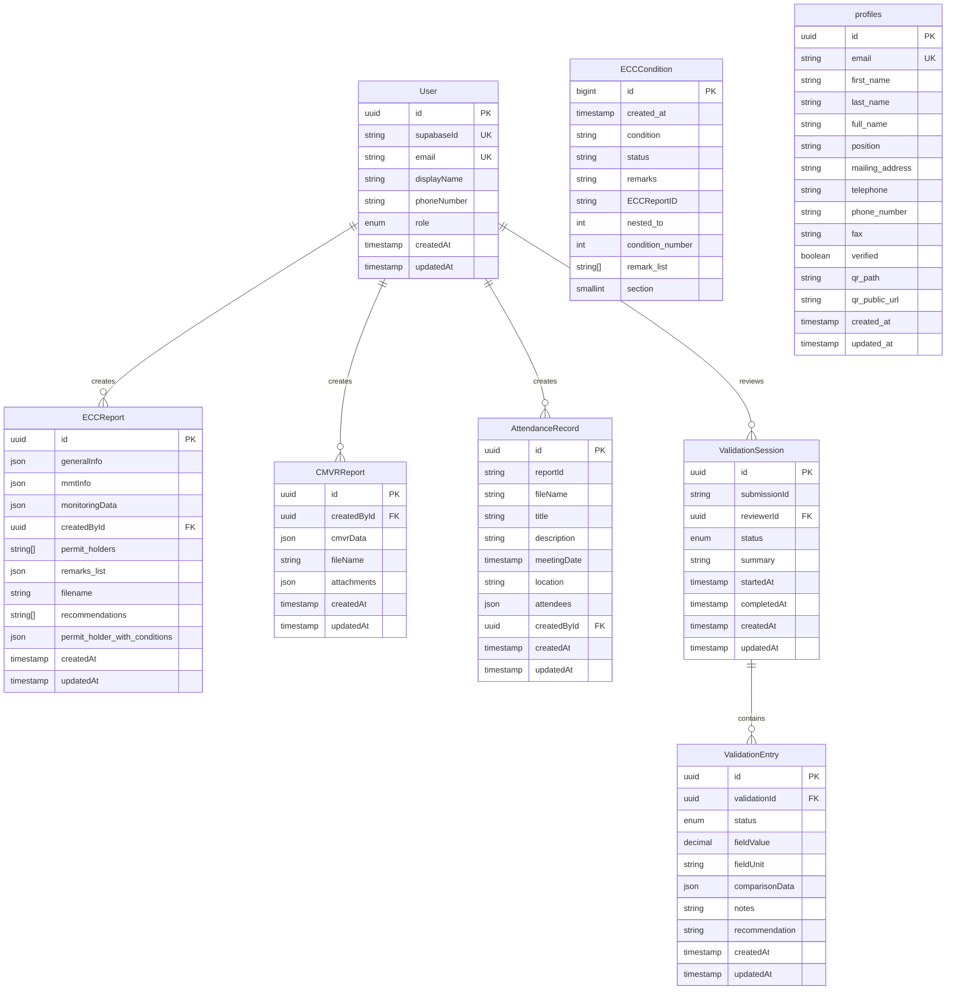

# MineComply API - Database Documentation

> Last Updated: December 2025  
> Database: PostgreSQL (Supabase)  
> ORM: Prisma 5.x

## Table of Contents

- [Overview](#overview)
- [Database Schema](#database-schema)
- [Table Descriptions](#table-descriptions)
- [Relationships](#relationships)
- [Row-Level Security (RLS)](#row-level-security-rls)
- [Migrations](#migrations)
- [Indexes](#indexes)
- [Data Types and Constraints](#data-types-and-constraints)
- [Best Practices](#best-practices)

---

## Overview

The MineComply platform uses **PostgreSQL** hosted on **Supabase** as its primary database. The database is accessed through **Prisma ORM**, which provides type-safe database operations and automatic migrations.

**Key Features:**
- **UUID Primary Keys**: All tables use UUIDs for primary keys
- **Timestamps**: `createdAt` and `updatedAt` on all main tables
- **JSON Storage**: Complex nested data stored in JSON columns
- **Row-Level Security**: Enabled on select tables for multi-tenancy
- **Foreign Keys**: Enforced relationships between users and their data

---

## Database Schema

### Entity Relationship Diagram



---

## Table Descriptions

### User

Stores application users synced from Supabase Auth.

| Column | Type | Constraints | Description |
|--------|------|-------------|-------------|
| `id` | uuid | PK, DEFAULT uuid() | Primary key |
| `supabaseId` | string | UNIQUE, NOT NULL | Supabase Auth user ID |
| `email` | string | UNIQUE, NULLABLE | User email address |
| `displayName` | string | NULLABLE | Display name |
| `phoneNumber` | string | NULLABLE | Contact phone number |
| `role` | UserRole | DEFAULT PROPONENT | User role (PROPONENT, MMT, REGULATOR, ADMIN) |
| `createdAt` | timestamp | DEFAULT now() | Record creation time |
| `updatedAt` | timestamp | AUTO | Last update time |

**Relationships:**
- `createdECCReports` → ECCReport[]
- `createdCMVRReports` → CMVRReport[]
- `validations` → ValidationSession[]
- `attendanceRecords` → AttendanceRecord[]

**Indexes:**
- Primary key on `id`
- Unique index on `supabaseId`
- Unique index on `email`

---

### ECCReport

Environmental Compliance Certificate reports with conditions and monitoring data.

| Column | Type | Constraints | Description |
|--------|------|-------------|-------------|
| `id` | uuid | PK, DEFAULT uuid() | Primary key |
| `generalInfo` | json | NULLABLE | General report information |
| `mmtInfo` | json | NULLABLE | MMT (Monitoring Team) information |
| `monitoringData` | json | NULLABLE | Monitoring observations and data |
| `createdById` | uuid | FK → User.id, NULLABLE | Report creator |
| `permit_holders` | string[] | DEFAULT [] | List of permit holder names |
| `remarks_list` | json | NULLABLE | Structured remarks data |
| `filename` | string | NULLABLE | Report filename |
| `recommendations` | string[] | DEFAULT [] | List of recommendations |
| `permit_holder_with_conditions` | json | NULLABLE | Permit holders with their conditions |
| `createdAt` | timestamp | DEFAULT now() | Record creation time |
| `updatedAt` | timestamp | AUTO | Last update time |

**Relationships:**
- `createdBy` → User

**Indexes:**
- Primary key on `id`
- Index on `createdById` (`idx_ecc_report_creator`)

---

### CMVRReport

Compliance Monitoring and Validation Reports with comprehensive compliance data.

| Column | Type | Constraints | Description |
|--------|------|-------------|-------------|
| `id` | uuid | PK, DEFAULT uuid() | Primary key |
| `createdById` | uuid | FK → User.id, NULLABLE | Report creator |
| `cmvrData` | json | NULLABLE | Complete CMVR report data structure |
| `fileName` | string | NULLABLE | Report filename |
| `attachments` | json | DEFAULT [] | Array of attachment objects with path and caption |
| `createdAt` | timestamp | DEFAULT now() | Record creation time |
| `updatedAt` | timestamp | AUTO | Last update time |

**CMVR Data Structure:**
```typescript
{
  generalInfo: {
    companyName: string;
    location: string;
    quarter: string;
    year: string;
    dateOfCompliance: string;
    monitoringPeriod: string;
    dateOfCMRSubmission: string;
  };
  executiveSummaryOfCompliance: { ... };
  processDocumentationOfActivitiesUndertaken: { ... };
  complianceToProjectLocationAndCoverageLimits: { ... };
  complianceToImpactManagementCommitments: { ... };
  airQualityImpactAssessment: { ... };
  waterQualityImpactAssessment: { ... };
  noiseQualityImpactAssessment: { ... };
  complianceWithGoodPracticeInSolidAndHazardousWasteManagement: { ... };
  complianceWithGoodPracticeInChemicalSafetyManagement: { ... };
  complaintsVerificationAndManagement: [ ... ];
  recommendationFromPrevQuarter: { ... };
  recommendationForNextQuarter: { ... };
  attendanceId: string | null;
}
```

**Relationships:**
- `createdBy` → User

**Indexes:**
- Primary key on `id`
- Index on `createdById` (`idx_cmvr_report_creator`)

---

### AttendanceRecord

Meeting attendance records with participant signatures and details.

| Column | Type | Constraints | Description |
|--------|------|-------------|-------------|
| `id` | uuid | PK, DEFAULT uuid() | Primary key |
| `reportId` | string | NULLABLE | Associated report ID (CMVR/ECC) |
| `fileName` | string | NOT NULL | Attendance record filename |
| `title` | string | NULLABLE | Meeting title |
| `description` | string | NULLABLE | Meeting description/notes |
| `meetingDate` | timestamp | NULLABLE | Date and time of meeting |
| `location` | string | NULLABLE | Meeting location |
| `attendees` | json | NOT NULL | Array of attendee objects |
| `createdById` | uuid | FK → User.id, NULLABLE | Record creator |
| `createdAt` | timestamp | DEFAULT now() | Record creation time |
| `updatedAt` | timestamp | AUTO | Last update time |

**Attendees Structure:**
```typescript
[
  {
    name: string;
    organization: string;
    position: string;
    signature: string; // Base64 image data
  }
]
```

**Relationships:**
- `createdBy` → User

**Indexes:**
- Primary key on `id`
- Index on `reportId` (`idx_attendance_record_report`)
- Index on `createdById` (`idx_attendance_record_creator`)

---

### ValidationSession

Validation sessions conducted by MMT reviewers.

| Column | Type | Constraints | Description |
|--------|------|-------------|-------------|
| `id` | uuid | PK, DEFAULT uuid() | Primary key |
| `submissionId` | string | NOT NULL | ID of submission being validated |
| `reviewerId` | uuid | FK → User.id, NOT NULL | Reviewer conducting validation |
| `status` | ValidationStatus | DEFAULT IN_PROGRESS | Session status |
| `summary` | string | NULLABLE | Validation summary notes |
| `startedAt` | timestamp | DEFAULT now() | Validation start time |
| `completedAt` | timestamp | NULLABLE | Validation completion time |
| `createdAt` | timestamp | DEFAULT now() | Record creation time |
| `updatedAt` | timestamp | AUTO | Last update time |

**ValidationStatus Enum:**
- `NOT_STARTED`
- `IN_PROGRESS`
- `COMPLETED`
- `NEEDS_INFORMATION`

**Relationships:**
- `reviewer` → User
- `entries` → ValidationEntry[]

**Indexes:**
- Primary key on `id`
- Index on `submissionId` (`idx_validation_submission`)
- Index on `reviewerId` (`idx_validation_reviewer`)

---

### ValidationEntry

Individual validation entries within a session.

| Column | Type | Constraints | Description |
|--------|------|-------------|-------------|
| `id` | uuid | PK, DEFAULT uuid() | Primary key |
| `validationId` | uuid | FK → ValidationSession.id, NOT NULL | Parent validation session |
| `status` | ValidationOutcome | DEFAULT APPROVED | Validation outcome |
| `fieldValue` | decimal(12,4) | NULLABLE | Measured field value |
| `fieldUnit` | string | NULLABLE | Unit of measurement |
| `comparisonData` | json | NULLABLE | Comparative data for validation |
| `notes` | string | NULLABLE | Validation notes |
| `recommendation` | string | NULLABLE | Recommendations |
| `createdAt` | timestamp | DEFAULT now() | Record creation time |
| `updatedAt` | timestamp | AUTO | Last update time |

**ValidationOutcome Enum:**
- `APPROVED`
- `CONDITIONALLY_APPROVED`
- `REQUIRES_CORRECTION`
- `REJECTED`
- `NOT_APPLICABLE`

**Relationships:**
- `validation` → ValidationSession

**Indexes:**
- Primary key on `id`
- Index on `validationId` (`idx_validation_entry_session`)

---

### ECCCondition

ECC conditions with Row-Level Security enabled.

| Column | Type | Constraints | Description |
|--------|------|-------------|-------------|
| `id` | bigint | PK, AUTO INCREMENT | Primary key |
| `created_at` | timestamp | DEFAULT now() | Record creation time |
| `condition` | string | NULLABLE | Condition text |
| `status` | string | NULLABLE | Compliance status |
| `remarks` | string | NULLABLE | General remarks |
| `ECCReportID` | string | NULLABLE | Associated ECC report ID |
| `nested_to` | int | NULLABLE | Parent condition ID (for nested conditions) |
| `condition_number` | int | NULLABLE | Condition numbering |
| `remark_list` | string[] | DEFAULT [] | Structured remarks list |
| `section` | smallint | NULLABLE | Report section number |

**Note:** This table has Row-Level Security enabled. See [RLS section](#row-level-security-rls) for details.

**Indexes:**
- Primary key on `id`

---

### profiles

Supabase profiles table with extended user metadata and QR codes.

| Column | Type | Constraints | Description |
|--------|------|-------------|-------------|
| `id` | uuid | PK | Primary key (matches Supabase Auth UID) |
| `email` | string | UNIQUE, NULLABLE | User email |
| `first_name` | string | NULLABLE | First name |
| `last_name` | string | NULLABLE | Last name |
| `full_name` | string | NULLABLE | Full name |
| `position` | string | NULLABLE | Job position |
| `mailing_address` | string | NULLABLE | Mailing address |
| `telephone` | string | NULLABLE | Telephone number |
| `phone_number` | string | NULLABLE | Mobile phone number |
| `fax` | string | NULLABLE | Fax number |
| `verified` | boolean | DEFAULT false | Email verification status |
| `qr_path` | string | NULLABLE | QR code file path in storage |
| `qr_public_url` | string | NULLABLE | Public URL for QR code |
| `created_at` | timestamp | DEFAULT now() | Record creation time |
| `updated_at` | timestamp | NULLABLE | Last update time |

**Note:** This table has Row-Level Security enabled.

**Indexes:**
- Primary key on `id`
- Unique index on `email`

---

## Relationships

### One-to-Many Relationships

**User → ECCReport**
- A user can create multiple ECC reports
- Enforced via `ECCReport.createdById` FK

**User → CMVRReport**
- A user can create multiple CMVR reports
- Enforced via `CMVRReport.createdById` FK

**User → AttendanceRecord**
- A user can create multiple attendance records
- Enforced via `AttendanceRecord.createdById` FK

**User → ValidationSession**
- A user (reviewer) can conduct multiple validation sessions
- Enforced via `ValidationSession.reviewerId` FK

**ValidationSession → ValidationEntry**
- A validation session contains multiple entries
- Enforced via `ValidationEntry.validationId` FK

### Soft Relationships

**AttendanceRecord → Report**
- `AttendanceRecord.reportId` stores a string ID
- Not enforced as FK (can link to CMVR or ECC)

**CMVRReport → AttendanceRecord**
- `cmvrData.attendanceId` stores attendance record UUID
- Not enforced as FK (stored in JSON)

---

## Row-Level Security (RLS)

RLS is enabled on certain tables to implement multi-tenancy and prevent data leakage between organizations.

### Enabled Tables

1. **ECCCondition**
2. **profiles**

### Policy Application

Policies are defined in `prisma/policies/enable_rls.sql` and applied manually after migrations:

```bash
npx prisma db execute --file prisma/policies/enable_rls.sql --schema prisma/schema.prisma
```

### Example Policies

**ECCCondition Policies:**

```sql
-- Enable RLS
ALTER TABLE "ECCCondition" ENABLE ROW LEVEL SECURITY;

-- Allow authenticated users to read their own conditions
CREATE POLICY "Users can view own ECC conditions"
ON "ECCCondition"
FOR SELECT
USING (
  auth.uid()::text IN (
    SELECT "supabaseId" FROM "User"
    WHERE "id"::text = "ECCCondition"."ECCReportID"
  )
);

-- Service role has full access (used by API)
CREATE POLICY "Service role full access"
ON "ECCCondition"
FOR ALL
USING (auth.role() = 'service_role');
```

**profiles Policies:**

```sql
-- Enable RLS
ALTER TABLE "profiles" ENABLE ROW LEVEL SECURITY;

-- Users can read their own profile
CREATE POLICY "Users can view own profile"
ON "profiles"
FOR SELECT
USING (auth.uid() = id);

-- Users can update their own profile
CREATE POLICY "Users can update own profile"
ON "profiles"
FOR UPDATE
USING (auth.uid() = id);
```

### Service Role vs Authenticated Access

- **API Server**: Uses `SUPABASE_SERVICE_ROLE_KEY` to bypass RLS
- **Direct Client Access**: Uses `SUPABASE_ANON_KEY` with RLS enforced
- **Current Setup**: All data access goes through API (service role)

---

## Migrations

### Migration Workflow

1. **Modify Prisma Schema**: Edit `prisma/schema.prisma`
2. **Create Migration**: `npm run prisma:migrate` or `npx prisma migrate dev --name <name>`
3. **Apply to Production**: `npx prisma migrate deploy`
4. **Regenerate Client**: `npm run prisma:generate` (automatic with migrate)

### Migration History

Migrations are stored in `prisma/migrations/`:

```
prisma/migrations/
├── 20251006013332_base_schema/
│   └── migration.sql
├── 20251012160708_add_attendance_records/
│   └── migration.sql
├── 20251012164300_add_creator_to_attendance_records/
│   └── migration.sql
├── 20251012180306_add_remove_tables/
│   └── migration.sql
├── 20251018144942_restructure_submissions_to_ecc_and_cmvr_reports/
│   └── migration.sql
└── migration_lock.toml
```

### Manual Migrations

Some migrations require manual SQL execution:

**Consolidate CMVR Fields:**
```bash
npx prisma db execute --file prisma/migrations/consolidate_cmvr_fields.sql
```

**Apply RLS Policies:**
```bash
npx prisma db execute --file prisma/policies/enable_rls.sql
```

### Rollback Migrations

Rollback scripts are provided for critical migrations:

```bash
npx prisma db execute --file prisma/migrations/rollback_consolidate_cmvr_fields.sql
```

---

## Indexes

### Automatic Indexes

Prisma automatically creates indexes for:
- Primary keys (`@id`)
- Unique constraints (`@unique`)
- Foreign keys (in relationMode: "prisma")

### Custom Indexes

Defined in Prisma schema with `@@index`:

```prisma
model ECCReport {
  // ...
  @@index([createdById], map: "idx_ecc_report_creator")
}

model CMVRReport {
  // ...
  @@index([createdById], map: "idx_cmvr_report_creator")
}

model AttendanceRecord {
  // ...
  @@index([reportId], map: "idx_attendance_record_report")
  @@index([createdById], map: "idx_attendance_record_creator")
}

model ValidationSession {
  // ...
  @@index([submissionId], map: "idx_validation_submission")
  @@index([reviewerId], map: "idx_validation_reviewer")
}

model ValidationEntry {
  // ...
  @@index([validationId], map: "idx_validation_entry_session")
}
```

### Performance Considerations

- Indexes speed up queries on foreign keys and frequently filtered columns
- JSON columns are not indexed (use JSONB for better performance if needed)
- Consider adding indexes on `createdAt` for time-based queries

---

## Data Types and Constraints

### UUID Generation

All primary keys use UUID v4:

```prisma
id String @id @default(uuid())
```

### Timestamps

Automatic timestamp management:

```prisma
createdAt DateTime @default(now())
updatedAt DateTime @updatedAt
```

### Enums

Type-safe enums for status fields:

```prisma
enum UserRole {
  PROPONENT
  MMT
  REGULATOR
  ADMIN
}

enum ValidationStatus {
  NOT_STARTED
  IN_PROGRESS
  COMPLETED
  NEEDS_INFORMATION
}

enum ValidationOutcome {
  APPROVED
  CONDITIONALLY_APPROVED
  REQUIRES_CORRECTION
  REJECTED
  NOT_APPLICABLE
}
```

### JSON Storage

Complex nested data stored as JSON:

```prisma
cmvrData Json?
attachments Json @default("[]")
```

**Recommendation:** Consider migrating to JSONB for better querying and indexing capabilities.

### Arrays

PostgreSQL arrays for simple lists:

```prisma
permit_holders String[]
recommendations String[] @db.VarChar
remark_list String[]
```

---

## Best Practices

### Schema Design

1. **Use UUIDs for primary keys** - Better for distributed systems
2. **Always include timestamps** - Track creation and modification
3. **Normalize where appropriate** - Avoid excessive JSON nesting
4. **Use enums for status fields** - Type safety and validation
5. **Index foreign keys** - Improve query performance

### Data Integrity

1. **Foreign key constraints** - Ensure referential integrity
2. **NOT NULL constraints** - Prevent invalid states
3. **Default values** - Sensible defaults for optional fields
4. **Unique constraints** - Prevent duplicates

### JSON Data

1. **Validate JSON structure** - Use DTO validation in application layer
2. **Document JSON schemas** - Clear structure for complex objects
3. **Consider JSONB** - Better performance for querying JSON
4. **Avoid deep nesting** - Keep JSON structures flat when possible

### Migrations

1. **Test migrations locally** - Always test before production
2. **Backup before deploy** - Supabase provides automatic backups
3. **Use descriptive names** - Clear migration naming conventions
4. **Version control** - Commit migration files to git

### Security

1. **Use service role carefully** - Never expose to clients
2. **Enable RLS on sensitive tables** - Implement multi-tenancy
3. **Validate input** - Use Prisma and DTO validation
4. **Audit sensitive operations** - Track who modified what

---

## Query Examples

### Fetch User with Reports

```typescript
const user = await prisma.user.findUnique({
  where: { id: userId },
  include: {
    createdCMVRReports: true,
    createdECCReports: true,
    attendanceRecords: true,
  },
});
```

### Create CMVR Report

```typescript
const report = await prisma.cMVRReport.create({
  data: {
    fileName: 'Q3_2025_CMVR',
    cmvrData: { /* complex object */ },
    attachments: [{ path: '...', caption: '...' }],
    createdBy: { connect: { id: userId } },
  },
});
```

### Query with Filters

```typescript
const reports = await prisma.cMVRReport.findMany({
  where: {
    createdById: userId,
    createdAt: {
      gte: new Date('2025-01-01'),
      lte: new Date('2025-12-31'),
    },
  },
  orderBy: { createdAt: 'desc' },
  take: 10,
});
```

---

## Troubleshooting

### Common Issues

**Prisma Client Out of Sync:**
```bash
npm run prisma:generate
```

**Migration Conflicts:**
```bash
npx prisma migrate resolve --rolled-back <migration_name>
```

**RLS Policies Not Applied:**
```bash
npx prisma db execute --file prisma/policies/enable_rls.sql
```

### Database Tools

- **Prisma Studio**: `npm run prisma:studio` - Visual database editor
- **Supabase Dashboard**: Web-based SQL editor and table viewer
- **psql**: Direct PostgreSQL CLI access

---

## Future Improvements

1. **JSONB Migration**: Convert JSON columns to JSONB for better performance
2. **Full-Text Search**: Add PostgreSQL full-text search for reports
3. **Soft Deletes**: Implement soft delete pattern for audit trails
4. **Materialized Views**: Create views for complex report queries
5. **Partitioning**: Partition large tables by date for better performance
6. **Audit Logging**: Add comprehensive audit log table
7. **Relationship Enforcement**: Convert soft references to proper FKs where possible

